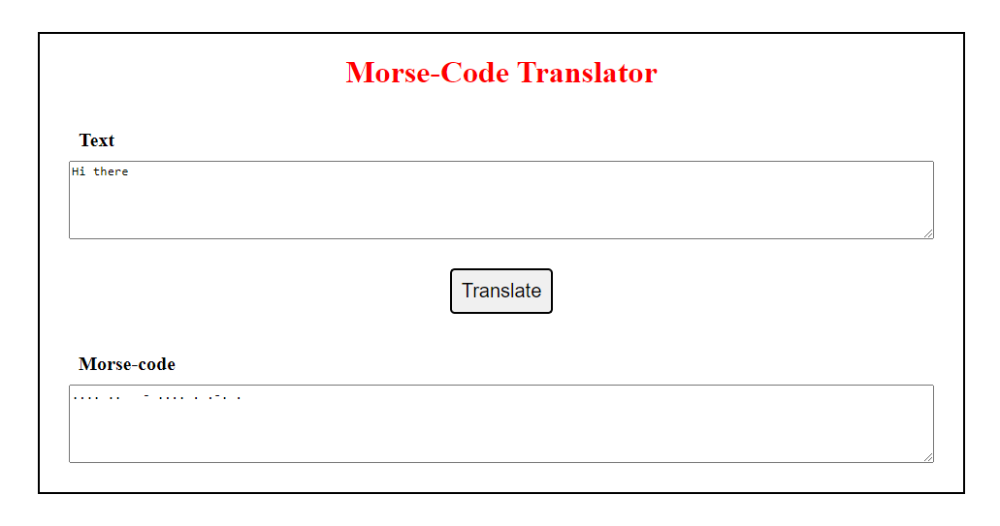

# Morse Code Translator

## Image of application


## Description
This application allows the user to either input some English text and translate it to Morse code or input some Morse Code and translate it into plain english text.

## Design Goals
My first goal was to check if the morse characters do exist or not in the morse code. and to check as well if the english text consists of letters only without any special characters.
Then, my goal was to handle correctly the spaces and split sentences into words then into letters to translate them. Between each character in morse code there is a single space, and between each word in morse code there is three space. 

## Approach
-   I separated pure JS functions and DOM manipulation

-   I added unit testings for each of the pure function that my translator uses.

## Useful Resources:

A to Z in Morse Code:
```
{
   "A": ".-",
   "B": "-...",
   "C": "-.-.",
   "D": "-..",
   "E": ".",
   "F": "..-.",
   "G": "--.",
   "H": "....",
   "I": "..",
   "J": ".---",
   "K": "-.-",
   "L": ".-..",
   "M": "--",
   "N": "-.",
   "O": "---",
   "P": ".--.",
   "Q": "--.-",
   "R": ".-.",
   "S": "...",
   "T": "-",
   "U": "..-",
   "V": "...-",
   "W": ".--",
   "X": "-..-",
   "Y": "-.--",
   "Z": "--.."
}

```
